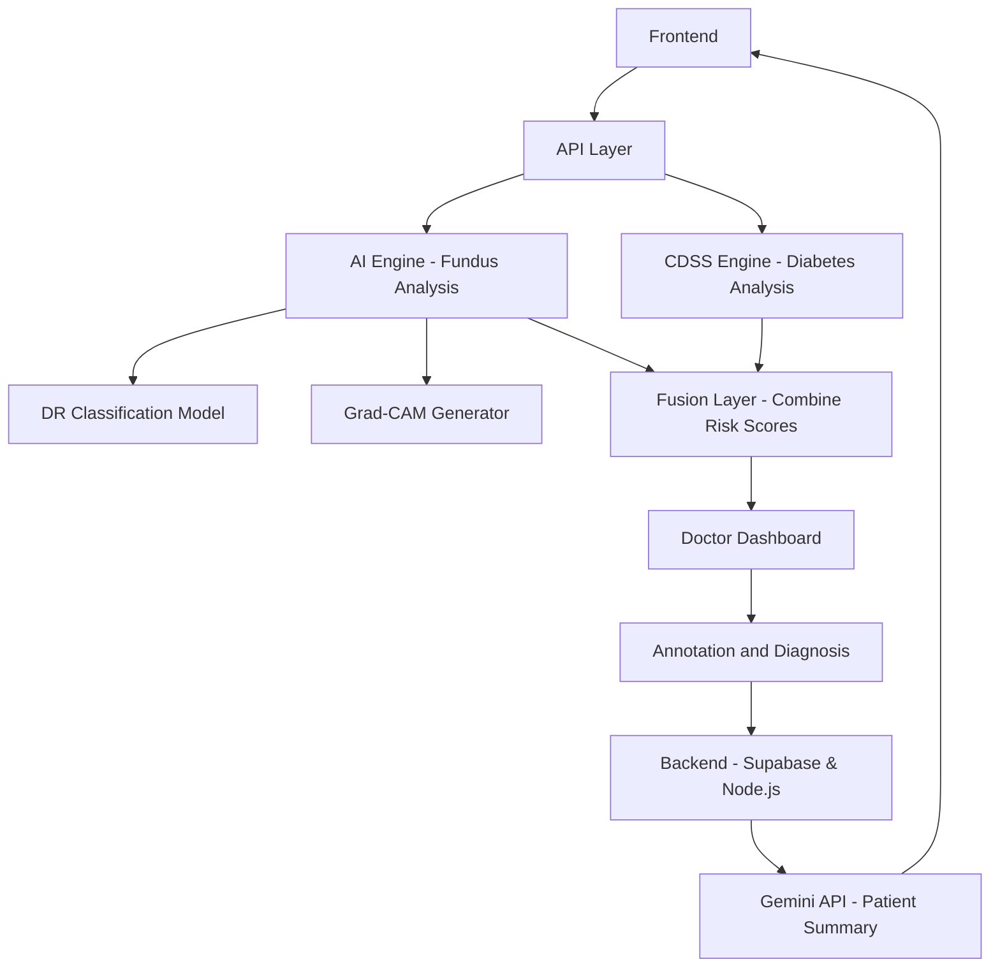
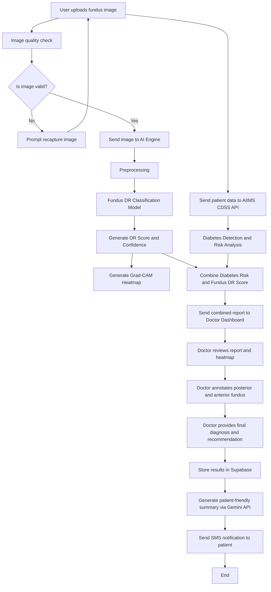
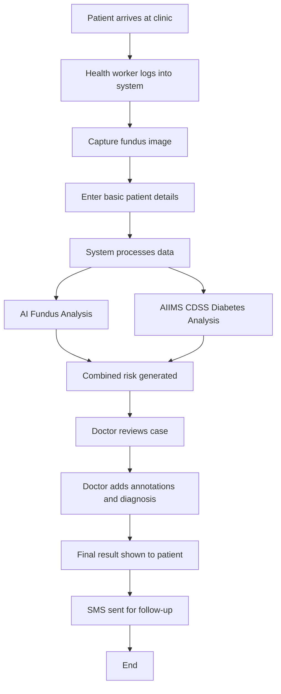

# Retinex: AI-Assisted Diabetic Retinopathy Screening

**Retinex** is a full-stack clinical decision support system (CDSS) designed for early screening of Diabetic Retinopathy (DR) in resource-constrained environments like Tier-2 cities and rural clinics. It integrates state-of-the-art AI vision models with systemic diabetes risk analysis to provide a unified risk score and clear clinical guidance.

---

## 🏗️ Architecture Overview

Retinex follows a modern, scalable serverless architecture:



---

## ⚙️ System Workflow

The system implements a multi-stage logic pipeline for screening.



---

## 👥 User Flow

Designed for ease of use by non-specialists in rural field clinics.



---

## 💾 Database Schema

Retinex utilizes a structured PostgreSQL schema optimized for clinical screening and doctor-in-the-loop review.

### Core Tables

| Table | Purpose |
| :--- | :--- |
| `profiles` | Stores user profile data and links to auth identities. |
| `user_roles` | Manages permissions (`asha_worker`, `doctor`, `admin`). |
| `patients` | Demographic data and systemic history (Diabetes duration, medication). |
| `screenings` | Individual screening sessions (image URL, status, capture metadata). |
| `ai_results` | Results from multiple AI models (DR class, confidence, CDSS score, Unified Risk). |
| `doctor_reviews`| Clinical decisions, annotations (Posterior & Anterior), and AI-generated summaries. |

---

## 🔄 User & Workflow Flow

### 1. Data Capture (Technician / ASHA Worker)
1. **Patient Registration**: Capture basic vitals and diabetes history.
2. **Fundus Imaging**: Upload retinal fundus image.
3. **Quality Validation**: Automatic client-side check for resolution, brightness, and contrast.
4. **Trigger Analysis**: Once uploaded, a Supabase Edge Function (`process-screening`) is triggered.

### 2. Processing & AI Analysis (Automated)
1. **Classification**: AI classifies DR grade (0-4) using vision models.
2. **Systemic Risk**: AIIMS CDSS analysis for diabetes risk based on patient metadata.
3. **Risk Fusion**: Weighted combination (60% Fundus, 40% CDSS) into a **Unified Risk Score** (Low, Moderate, High).
4. **Notification**: Automatically sends an SMS to the patient for high-risk cases.

### 3. Review & Reporting (Ophthalmologist)
1. **Explainable AI (XAI)**: Review heatmaps identifying "Regions of Concern" (e.g., Macula, Optic Disc).
2. **Clinical Annotations**: Specific sections for Posterior (Vessels/Periphery) and Anterior (Macula/Disk) findings.
3. **Report Generation**: AI generates two reports:
    - **Clinical Report**: Professional medical summary for records.
    - **Patient-Friendly Summary**: Compassionate, plain-language explanation with next steps.
4. **Final Sign-off**: Doctor saves review and notifies the patient with a personalized link.

---

## ✨ Features & Clinical Impact

### 🚀 Key Features
- **Explainable AI (XAI)**: Moves beyond "black box" AI by highlighting precisely where the model found anomalies.
- **Unified Risk Fusion**: Combines retinal findings with systemic history to prevent false negatives.
- **Mobile-First Design**: Fully responsive UI for tablets/smartphones used in the field.
- **Offline-Ready Support**: Designed for deployment in areas with intermittent connectivity.
- **Multi-lingual AI Summaries**: Translates clinical findings into patient-friendly language.

### 🏥 Clinical Impact
- **Increased Reach**: Enables non-specialists (ASHA workers) to perform screenings locally.
- **Efficiency**: Reduces specialist burden by highlighting only cases needing immediate intervention.
- **Patient Adherence**: Clear, actionable summaries and SMS follow-ups improve follow-up rates.
- **Standards Compliance**: Follows AIIMS and NHM screening guidelines.

---

## 🛠️ Getting Started

### Prerequisites
- Node.js & npm
- Supabase CLI
- Python 3.9+ (for AI engine)

### Local Setup
1. **Clone & Install**:
   ```bash
   npm install
   ```
2. **Supabase Setup**:
   ```bash
   supabase start
   supabase db reset
   ```
3. **AI Engine**:
   ```bash
   cd ai-engine
   pip install -r requirements.txt
   python main.py
   ```
4. **Start App**:
   ```bash
   npm run dev
   ```

---

*Built with ❤️ for rural healthcare and accessible screening.*
